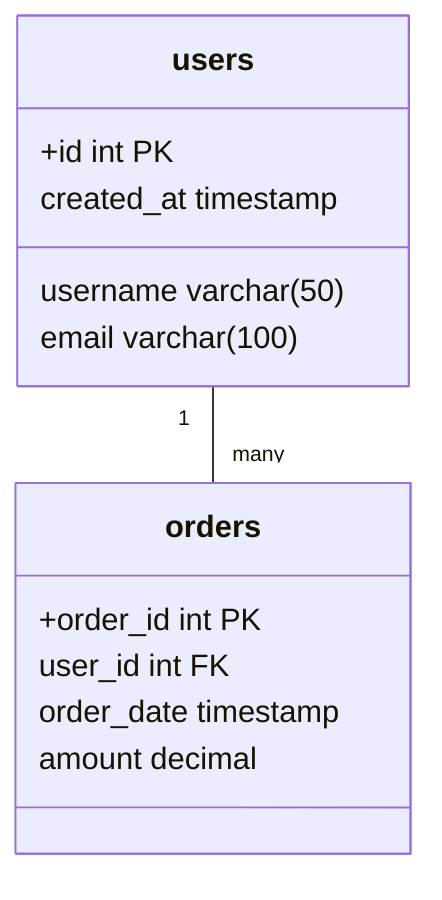

# GovOmniAgent

```mermaid
classDiagram
    class users {
        +id int PK
        username varchar(50)
        email varchar(100)
        created_at timestamp
    }
    
    class orders {
        +order_id int PK
        user_id int FK
        order_date timestamp
        amount decimal
    }
    
    users "1" -- "many" orders
```